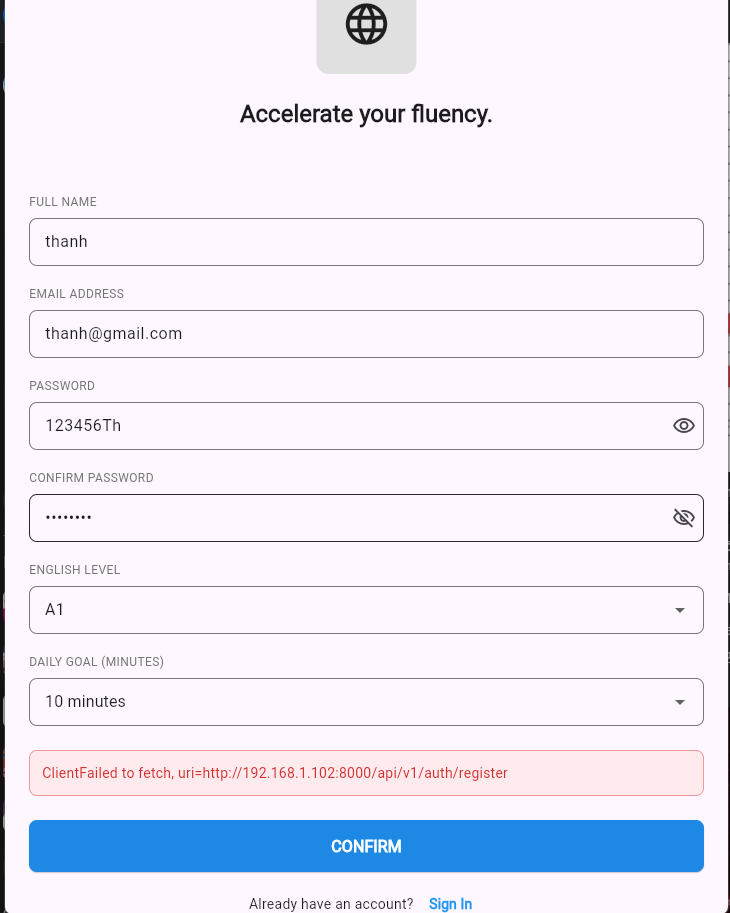

# My Python Backend

Một ứng dụng backend được xây dựng bằng FastAPI.

## Cấu trúc dự án

```
my-python-backend/
├── app/                # Thư mục chính chứa mã nguồn
│   ├── __init__.py
│   ├── main.py         # Điểm khởi đầu của ứng dụng
│   ├── api/            # Các route/endpoint
│   ├── core/           # Cấu hình (config, security)
│   ├── models/         # Database models
│   ├── schemas/        # Pydantic models (Data validation)
│   └── crud/           # Các hàm xử lý DB
├── tests/              # Thư mục chứa các bản test
├── .gitignore          # Các file không muốn đẩy lên GitHub
├── .env.example        # File mẫu chứa biến môi trường
├── requirements.txt    # Danh sách thư viện cần cài đặt
└── README.md           # Hướng dẫn dự án
```

## Hướng dẫn cài đặt

### Yêu cầu
- Python 3.8+
- pip

### Cài đặt môi trường

1. **Tạo virtual environment**
   ```bash
   python -m venv venv
   ```

2. **Kích hoạt virtual environment**
   - Trên Windows:
     ```bash
     venv\Scripts\activate
     ```
   - Trên macOS/Linux:
     ```bash
     source venv/bin/activate
     ```

3. **Cài đặt các thư viện**
   ```bash
   pip install -r requirements.txt
   ```

4. **Cấu hình biến môi trường**
   ```bash
   cp .env.example .env
   # Chỉnh sửa file .env với các giá trị thực tế
   ```

## Chạy ứng dụng

### Development
```bash
python -m uvicorn app.main:app --reload
```

Ứng dụng sẽ chạy tại: `http://localhost:8000`

API docs: `http://localhost:8000/docs`

### Production
```bash
uvicorn app.main:app --host 0.0.0.0 --port 8000
```

## Chạy tests

```bash
pytest
```

Hoặc với coverage:
```bash
pytest --cov=app
```

## Các lệnh hữu ích

- Cài đặt thêm gói: `pip install package-name`
- Cập nhật requirements: `pip freeze > requirements.txt`
- Kiểm tra linting: `pylint app/`
- Format code: `black app/`

## Tây Nguyên

Xin lỗi nếu có lỗi, vui lòng tạo issue hoặc liên hệ.
